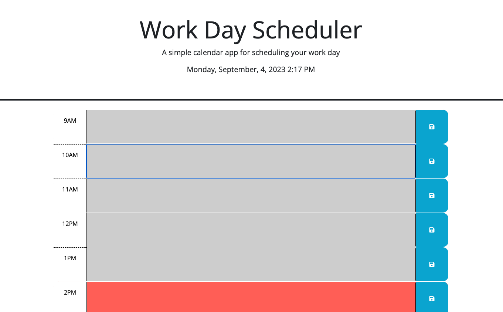
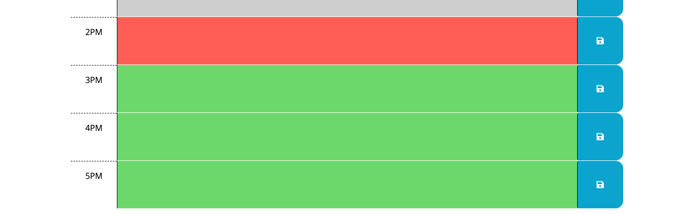

# Work-Day-Scheduler

## Description 

Busy workdays are a common experience for employees across industries. This daily scheduler is a great tool to help employees keep their tasks and obligations organized. 

The Workday Scheduler Features:

📅 Time blocks that change color based on the time of day.

⬜️ Gray: Past
🟥 Red: Gray
🟩 Green: Future 

📅 Events saved in local storage that remain on the scheduler even after a page refresh. 
_________________________________________

## Access 🔗

To access the workday scheduler, simply click on the GitHub Pages link in the repo description or follow this link: [Workday Scheduler](lillian.edwards.gihub.io/Work-Day-Scheduler) 
_________________________________________

## Usage 

## Credit 
I worked on this project alone, but received help from my TA Justin Moore and classmate, Pete Richards.

## License 
This project is not licensed. 
